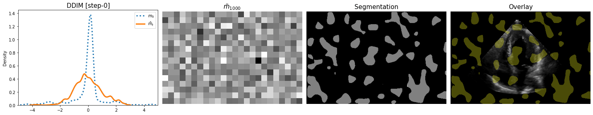

# LDSeg

--------------------

## Dataset
1. Echo (2D+t)
2. [GlaS (2D)](https://www.kaggle.com/datasets/sani84/glasmiccai2015-gland-segmentation) 
3. [knee (3D)](https://nda.nih.gov/oai/)

## Segmentation Examples
A few examples of segmentation are shown below for the Echo, GlaS and Knee datasets. Top row shows the source images/image-slices, 2nd and 3rd row shows the reverse diffusion for the latent space and the segmentation outputs. The bottom layer shows the segmentations overlay on the source images.

--------------------

### <ins> 
 Echo </ins>

 

### <ins> 
 GlaS </ins>

 

### <ins> 
 Knee </ins>

--------------------

## Sampling Algorithms
An example of Echo segmentation for DDPM [1] and DDIM [2] sampling algorithms with 20 evenly spaced sampling steps are shown below:

--------------------

### <ins> 
 DDPM </ins>

### <ins> 
 DDIM </ins>

--------------------

## Robustness to noises
An example from each dataset is shown to demonstrate the model robustness to noise. Here, $\sigma$ is the variance of the added noise to the source image. DSC is the Dice Similarity Co-efficient score for the image (2D/3D). For the Knee dataset, a randomly selected slice is shown for convenience.

--------------------

### <ins> 
 Echo </ins>

 

### <ins> 
 GlaS </ins>

 

### <ins> 
 Knee </ins>

--------------------

## References

1. Ho, Jonathan, Ajay Jain, and Pieter Abbeel. "Denoising diffusion probabilistic models." Advances in neural information processing systems 33 (2020): 6840-6851.
2. Song, Jiaming, Chenlin Meng, and Stefano Ermon. "Denoising diffusion implicit models." arXiv preprint arXiv:2010.02502 (2020).

# LDSeg
